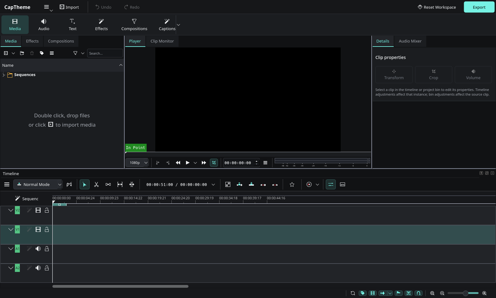
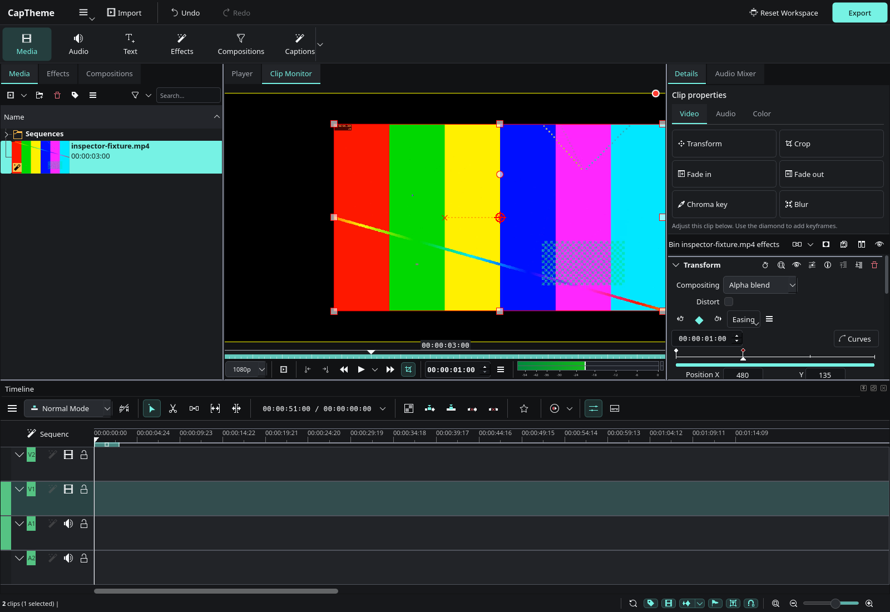

# CapTheme — Alpha

**Versão: `v0.1.0-alpha.1` · Pré-lançamento experimental · Linux**

Esta alpha permite testar a nova interface. Ainda não é uma versão estável;
use cópias dos seus projetos ao experimentar. Não há instalador ou AppImage nesta versão.

Fork do Kdenlive com interface de edição inspirada no CapCut desktop.
O código-fonte completo está em `kdenlive/`, com os avisos de autoria e as licenças originais.
Esta publicação contém um snapshot modificado do Kdenlive; a origem está identificada abaixo.
Base: `https://github.com/KDE/kdenlive`, commit `046da7d04fc66206d61468664f079ab84902eaac`.



## Executar

Ambiente validado: **CachyOS (base Arch Linux), x86_64**. Windows, macOS,
Flatpak e outras distribuições ainda não foram validados nesta alpha.

1. Instale as ferramentas e dependências:

   ```sh
   sudo pacman -S --needed base-devel git cmake ninja extra-cmake-modules qt6-tools kdenlive
   ```

   O pacote oficial `kdenlive` fornece as dependências de execução e os headers
   correspondentes no Arch/CachyOS. O CapTheme será compilado e instalado em outra pasta.

2. Baixe a alpha:

   ```sh
   git clone --branch v0.1.0-alpha.1 --depth 1 https://github.com/agracas/CapTheme.git
   cd CapTheme
   ```

3. Compile e abra:

   ```sh
   ./build.sh
   ./run.sh
   ```

A primeira compilação pode demorar e precisa de alguns gigabytes livres.
O download **Source code** da release também contém o código completo: extraia-o,
abra um terminal na pasta extraída e execute os mesmos scripts.

A compilação também usa Qt 6.10+, KDE Frameworks 6.21+, FFmpeg e os demais
componentes listados em `kdenlive/CMakeLists.txt`. O build usa 6 tarefas por padrão;
`CAPTHEME_JOBS=4 ./build.sh` reduz o consumo de memória.

O programa é instalado em `install/`, sem substituir um Kdenlive do sistema.
O launcher mantém configurações e caches em `.runtime/` e aceita caminhos de
projetos: `./run.sh /caminho/projeto.kdenlive`.

## Interface

Para experimentar o painel atualizado na versão de desenvolvimento (ainda alpha),
baixe a branch `main` em uma nova pasta:

```sh
git clone --branch main https://github.com/agracas/CapTheme.git CapTheme-dev
cd CapTheme-dev
./build.sh
./run.sh
```

Para atualizar essa cópia posteriormente, feche o programa e execute
`git pull --ff-only`, `./build.sh` e `./run.sh`. A release `v0.1.0-alpha.1`
preserva a primeira versão e não inclui o novo painel.

- Tema grafite com seleção verde-água, abas e campos compactos.
- Barra superior com Importar, Desfazer/Refazer e Exportar; categorias de edição em uma faixa própria com ícones.
- Campos, menus, listas, abas e barras de rolagem com acabamento escuro consistente.
- Mídia à esquerda, monitor ao centro, propriedades à direita, timeline embaixo.
- Os botões usam os comandos reais do Kdenlive, inclusive seus estados habilitados.
- O layout é criado no primeiro uso. Alterações posteriores são preservadas.
- **Reset Workspace** restaura a organização proposta; os menus completos ficam no botão de menu.

“Áudio” abre o mixer; “Texto” cria um título; “Legendas” abre a geração automática
a partir do áudio da timeline. “Composições” abre as composições do Kdenlive. Essas funções não são
catálogos online do CapCut. O projeto não inclui recursos, serviços ou marcas do CapCut.

Para abrir o fork com a interface original e configurações separadas:

```sh
CAPTHEME_CLASSIC=1 ./run.sh --config classicrc
```

### Legendas automáticas

1. Coloque o vídeo ou áudio na timeline.
2. Clique em **Captions / Legendas** para abrir **Automatic Subtitling**, a ferramenta nativa do Kdenlive.
3. Se necessário, use **Configure** no diálogo para configurar o reconhecimento de fala e instalar as dependências e um modelo Whisper ou Vosk.
4. Selecione o modelo, o idioma quando disponível e o trecho a analisar (timeline, zona, faixa ou clipes selecionados). Clique em **Process**.
5. Revise o resultado na faixa de legendas. A seta ao lado de **Captions** também oferece criação manual, importação, exportação e gerenciamento de legendas.

Os motores e modelos seguem a configuração do Kdenlive dentro do perfil isolado
do CapTheme. Não estão incluídos na distribuição; sua instalação pode exigir
internet e espaço em disco. O teste gráfico verifica a abertura do diálogo real,
mas não baixa modelos nem valida a qualidade da transcrição.

## Código

### Painel Details: transformação e animação

Na versão de desenvolvimento, selecione um clipe e use os atalhos no painel direito:

| Categoria | Controles nativos |
| --- | --- |
| **Vídeo** | Transformação (posição, escala, rotação e opacidade), recorte, fades de entrada/saída, chroma key e desfoque. |
| **Áudio** | Volume, balanço estéreo, fades de entrada/saída, equalizador, compressor e normalização dinâmica. |
| **Cor** | Brilho, correção básica (contraste, brilho, gamma e saturação), saturação, gamma, rodas de cor e balanço por três pontos. |

As categorias abrem os controles nativos na pilha de efeitos abaixo. A pilha mantém
a ordem de processamento de todos os efeitos aplicados; trocar de categoria não
altera o resultado nem adiciona efeitos. Cliques de áudio só ficam ativos em clipes
com áudio, e os de vídeo/cor em clipes com imagem. Efeitos ausentes na instalação
ficam desabilitados com uma explicação no tooltip. Ao selecionar áudio sem vídeo,
a categoria Áudio é aberta automaticamente.

O primeiro clique adiciona o efeito correspondente; os próximos abrem o efeito já
existente, preservando seus valores. Sem um clipe selecionado, os atalhos ficam
desabilitados. Controles de vídeo e áudio acompanham o tipo de clipe selecionado.

Nos controles do efeito, mova o cursor e use o botão de losango para adicionar ou
remover keyframes. As setas navegam entre eles; os ajustes usam o desfazer/refazer
e o formato de projeto do Kdenlive. Na timeline, as mudanças afetam a instância
selecionada; na biblioteca de mídia, afetam o clipe de origem.

### Animação e keyframes

Nos efeitos animáveis, a barra acima da régua reúne:

- **◇ / ◆**: adiciona ou remove um keyframe no cursor; o losango cheio indica um ponto existente. O primeiro ponto obrigatório segue a proteção do Kdenlive.
- **Setas**: avançam para o próximo keyframe ou voltam ao anterior.
- **Easing**: escolhe a interpolação nativa para o keyframe selecionado.
- **Curves / Keyframes**: alterna entre as curvas dos parâmetros e a régua de pontos.
- **Menu de opções**: copiar, colar, mover pontos ao cursor e outras operações nativas.

Para animar, ajuste o estado inicial, mova o cursor, clique no losango vazio e
altere os valores. Os pontos podem ser arrastados na régua. Desfazer/refazer e o
salvamento usam o projeto original do Kdenlive. Os keyframes são agrupados por
efeito; esta adaptação não reproduz a separação por propriedade do CapCut.

O controle de rotação pode depender da versão do efeito Transform fornecida pelo MLT.



Teste do inspector:

```sh
./tests/inspector-smoke.sh
```

O teste importa um vídeo sintético com áudio, altera escala, opacidade e posição,
confere desfazer/refazer e ausência de duplicação, cria um segundo keyframe e salva
o projeto. O teste também abre as categorias Áudio e Cor, adiciona Volume e Brilho, verifica
reabertura sem duplicação e desfazer/refazer. A validação do XML confirma os valores,
os dois keyframes e os efeitos de áudio e cor persistidos. Projetos separados com
áudio puro e vídeo sem áudio verificam a habilitação das categorias conforme a mídia.
Os arquivos de teste e a captura ficam em `artifacts/`.

### Arquivos principais

- `kdenlive/src/captheme.cpp`: barra, comandos e organização dos painéis.
- `kdenlive/data/captheme/`: paleta KDE e stylesheet Qt embutidos no executável.
- `kdenlive/src/mainwindow.cpp`: integração após restauração do workspace.
- `kdenlive/src/assets/assetpanel.cpp`: atalhos e contexto do inspector.
- `kdenlive/src/effects/effectstack/view/effectstackview.cpp`: abertura de efeitos existentes sem duplicação.

Esta implementação mantém os componentes de monitor, inspector e timeline do
Kdenlive. Não é uma reprodução pixel a pixel do CapCut nem implementa serviços
exclusivos dele. As mudanças do fork seguem a licença GPL do Kdenlive.

## Validação

Compilado e instalado localmente com GCC 16, Qt 6.11.2, KDE Frameworks 6.30 e MLT 7.40.
O teste gráfico passou na primeira abertura e após reiniciar: posição e visibilidade
dos painéis, paleta, menu compacto, comando de exportação, navegação para efeitos,
restauração repetida do workspace e fechamento normal. Uma terceira abertura
verifica o diálogo nativo de legendas automáticas e seus seletores de modelo e trecho. A captura acima foi feita
no executável real em uma tela virtual de 1920×1080, com janela de 1600×960.

Para repetir (requer `xorg-server-xvfb`):

```sh
./tests/ui-smoke.sh
```

Os logs e a captura ficam em `artifacts/`. Esse teste usa um projeto vazio e não
valida edição ou renderização de um vídeo completo. Os testes de interface são
carregados externamente; o executável não contém comandos de teste.

Referências: [personalização do Kdenlive](https://docs.kdenlive.org/en/user_interface/customizing_interface.html),
[código original](https://github.com/KDE/kdenlive),
[compilação upstream](https://github.com/KDE/kdenlive/blob/master/dev-docs/build.md).

## Limitações da alpha

- A aparência e o layout ainda podem mudar; não é uma cópia exata do CapCut.
- O motor de edição, os monitores e a timeline continuam sendo os do Kdenlive.
- Recursos online, templates e serviços exclusivos do CapCut não estão incluídos.
- Algumas legendas da nova interface podem aparecer em inglês.
- Edição prolongada, renderização de projetos completos e compatibilidade com diferentes GPUs ainda precisam de validação.
- A base é uma revisão de desenvolvimento do Kdenlive, não uma versão estável dele.

## Problemas ao executar

- **“Compile primeiro”**: execute `./build.sh` e confirme que ele terminou sem erros.
- **Dependência ausente no CMake**: confira as versões mínimas acima e o erro do CMake.
- **Memória insuficiente durante a compilação**: use `CAPTHEME_JOBS=2 ./build.sh`.
- **Painéis fora do lugar**: use **Reset Workspace** na barra superior.

Relate problemas nas [Issues](https://github.com/agracas/CapTheme/issues), incluindo
a versão da alpha, distribuição, GPU, passos para reproduzir e o erro do terminal.

## Licença e créditos

O CapTheme é uma modificação independente do [Kdenlive](https://kdenlive.org/),
sem afiliação com KDE ou CapCut. Veja [COPYING](COPYING),
[licenças dos componentes](kdenlive/LICENSES/) e os avisos de autoria no código.
As modificações de interface estão descritas em [CHANGELOG.md](CHANGELOG.md).
